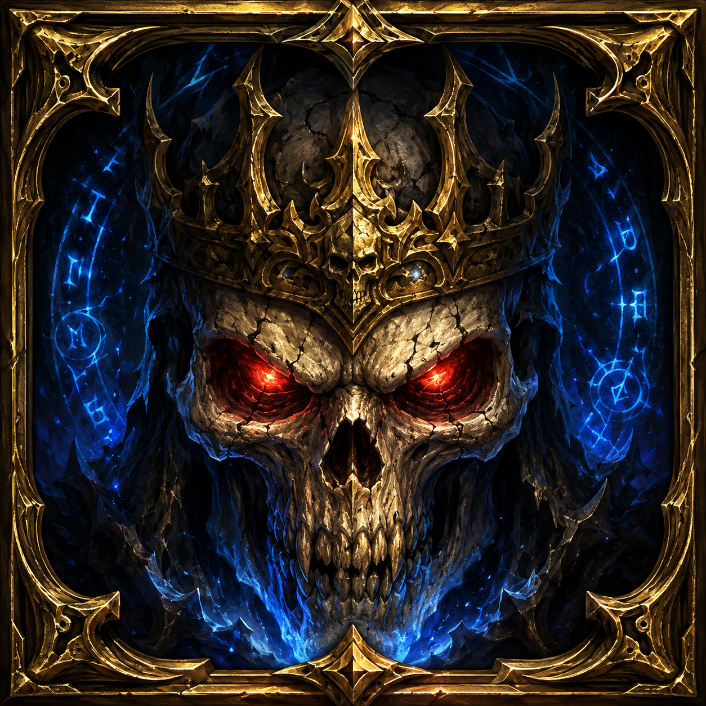

  

  # BossWatch

  **Modern, fully configurable boss frames for WoW Retail (Midnight 12.0) and MoP Classic 5.5.**

  
  
  
  
  
  

---

## What it does

BossWatch replaces Blizzard's default boss target frames with a custom, fully configurable replacement. One zip covers **both retail and MoP Classic** (multi-TOC). The options panel is built in the modern WoW UI style with search, collapsible sections, a resizable window, and live preview.

## Features

### Frames
- **Custom boss frames** (up to 5) with portrait, health & power bars, integrated cast bar, auras and target highlight
- **Smooth health bar animation** (interpolated, with secret-value taint guard for Midnight bosses)
- **Absorbs / shields overlay** drawn over the HP bar
- **Target highlight** border with optional pulse animation (static / class / reaction colors)
- **Raid target icon** overlay on each frame, freely positioned
- **3 or 4 block layout** — name overlaid on HP bar (compact) or on its own row above
- **Off-screen auto-recovery** — frames clamp to current `UIParent` bounds on load (e.g. after switching from a larger monitor to a smaller one)

### Cast bar
- Spell name, icon, optional detached layout
- Custom texture / position / icon placement
- Detached mode with its own anchor / width / offsets

### Auras
- Modern API (`C_UnitAuras.GetUnitAuraInstanceIDs` + `GetAuraDataByAuraInstanceID`) with native Blizzard sort priority
- Legacy `UnitAura` fallback for older Classic clients
- Filters: HARMFUL / HELPFUL × ALL / MINE / NOT_MINE / BOSS_ONLY
- Stack count, cooldown swipe, configurable timer placement (inside / above / below)
- **Tooltip on hover** — standard Blizzard tooltip when you mouse over an aura icon

### Click actions on boss frames
- **Shift+Click** cycles raid markers (skull → cross → star → …)
- **Ctrl+Click** sets focus
- Standard click targets the boss
- Combat-safe (secure attributes are applied out of combat)

### Options panel
- **Tabbed layout** with **search bar** (matches across all tabs land on a Results page)
- **Collapsible sections** with per-section reset button (🔄)
- **Resizable window** (drag the bottom-right grip; size + position saved account-wide)
- **Auto-flow** — right-column controls slide along the right edge when you widen the panel
- **Bottom tabs wrap** onto multiple rows when the panel is too narrow
- **Side tabs** on the left edge let you instantly switch between sister addons of the `*Watch` family (BossWatch / TankWatch / SplitWatch), with seamless window position handoff
- **Profile system** — per-character with import/export (clipboard b64 strings)
- **Minimap icon** (LibDBIcon, toggleable)

### Cross-client
- **One zip, two clients** — multi-TOC packages retail (`BossWatch.toc`) and MoP Classic (`BossWatch-Mists.toc`) together
- **Classic banner** at the top of the options panel reminds users on Classic that the UI hasn't been fully tested in encounters yet — please report bugs
- Handles WoW Midnight **secret-tagged unit values** (HP / Power / cast info / auras / raid markers on hostile bosses) — no Lua spam, graceful fallbacks everywhere

## Installation

### Via addon manager (recommended)
Search for **BossWatch** in [CurseForge](https://www.curseforge.com/wow/addons/bosswatch), [Wago](https://addons.wago.io/addons/bosswatch), [WoWUp](https://wowup.io/), or your manager of choice. The same zip works on both retail and MoP Classic.

### Manual
1. Download the latest release from the [Releases page](https://github.com/Timikana/BossWatch/releases)
2. Extract the `BossWatch` folder into either:
   - `World of Warcraft/_retail_/Interface/AddOns/`
   - `World of Warcraft/_classic_/Interface/AddOns/`
3. Restart WoW or `/reload`

## Slash commands

| Command | Description |
|---|---|
| `/bossw` (or `/bosswatch`) | Open the options panel |
| `/bossw mover` | Toggle the drag handle to reposition the boss container |
| `/bossw test N` | Simulate N bosses (0 to 5) with HP drain, casts and auras |
| `/bossw auras [unit]` | Debug: dump all auras on bosses (or given unit) with secret-tagged field detection |
| `/bossw reset` | Wipe all settings and reload the UI |

## Configuration

Open the options with `/bossw`. Tabs (bottom):

- **Disposition** — anchor, size, spacing, scale, portrait position, mover, test mode, target highlight, click actions, smooth bars
- **Barres** — health/power/absorb textures, color mode, background alphas
- **Incantation** — cast bar texture, icon position, detached layout
- **Texte** — name, HP, power text positioning + format, global font selector
- **Marqueur** — raid target icon placement on each frame
- **Auras** — filter, source, max count, size, anchoring, stacks, timer placement, tooltip on hover
- **Profils** — per-character profiles, import / export
- **À propos** — version, links, slash commands, full changelog history

## Localization

| Locale | Status |
|---|---|
| English (`enUS`) | ✓ Complete (fallback) |
| French (`frFR`) | ✓ Complete |
| German (`deDE`) | ◔ Partial |
| Spanish (`esES`) | ◔ Partial |
| Italian (`itIT`) | ◔ Partial |
| Brazilian Portuguese (`ptBR`) | ◔ Partial |

Want to contribute / complete a locale? Copy `Locales/frFR.lua`, change the `GetLocale()` check, translate the values (keep the keys identical), and open a PR.

## Bundled libraries

- [LibStub](https://www.wowace.com/projects/libstub)
- [CallbackHandler-1.0](https://www.wowace.com/projects/callbackhandler)
- [LibSharedMedia-3.0](https://www.wowace.com/projects/libsharedmedia-3-0)
- [LibDataBroker-1.1](https://github.com/tekkub/libdatabroker-1-1)
- [LibDBIcon-1.0](https://www.wowace.com/projects/libdbicon-1-0)

(All also declared as `externals:` in `.pkgmeta` for clean packaging.)

## Sister addons

BossWatch is part of the `*Watch` family — addons that share UI conventions, side-tabs for cross-addon switching, and a unified visual language:

- **[TankWatch](https://github.com/Timikana/TankWatch)** — tank visibility helpers + boss debuff stack tracking
- **SplitWatch** (in progress) — auto-balanced raid splits for split-mechanic fights

Install any sister addon and a side tab appears automatically on BossWatch's options panel.

## Changelog

Full version history is in [CHANGELOG.md](CHANGELOG.md). It's also accessible in-game from the **À propos** tab of the options panel.

## Issues & feedback

- Bugs / suggestions: [GitHub issues](https://github.com/Timikana/BossWatch/issues)
- Real-time support, discussion, release announcements: [Discord](https://discord.gg/uFmxwexQ4P) — **BossWatch & TankWatch** community

## License

[MIT](LICENSE) — feel free to fork, modify, and contribute back.

---

  Made with ❤ for the WoW Retail and MoP Classic communities.

